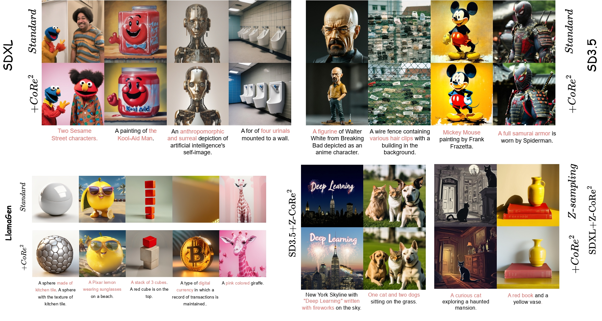
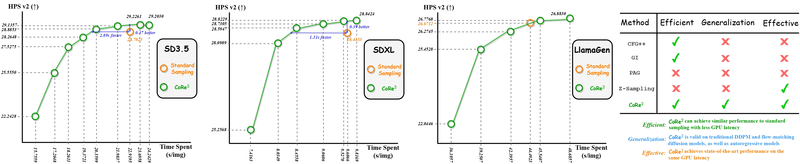
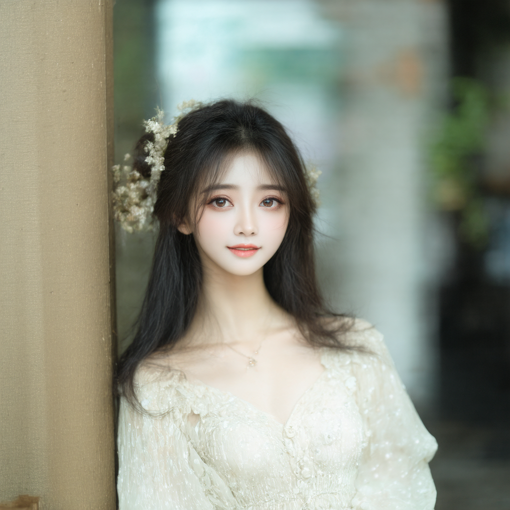

<!-- ---
license: mit
language:
- en
metrics:
- T2I-Compbench
- GenEval
- PickScore
- AES
- ImageReward
- HPSV2
new_version: v0.1
pipeline_tag: text-to-image
library_name: diffusers
tags:
- inference-enhanced algorithm
- efficiency
- effectiveness
- generalization
- weak-to-strong guidance
--- -->

# The Official Implementation of our Arxiv 2025 paper:

> **CoRe^2: _Collect, Reflect and Refine_ to Generate Better and Faster**

Authors:

>**<em>Shitong Shao, Zikai Zhou, Dian Xie, Yuetong Fang, Tian Ye, Lichen Bai</em> and <em>Zeke Xie*</em>** <br>
> xLeaf Lab, HKUST (GZ) <br>
> *: Corresponding author

<div align="center">
  <a href="https://github.com/xie-lab-ml/CoRe2/tree/main"></a> &ensp;
  <a href="https://huggingface.co/papers/2503.09662"></a> &ensp;
  <a href="https://arxiv.org/abs/2503.09662v1"></a>
</div>

<div align="center">
  <a href="https://huggingface.co/sst12345/CoRe2"></a> &ensp;
  <a href="https://huggingface.co/spaces/sst12345/CoRe2"></a>
</div>





## New

- [x] Release the inference code of SD3.5 and SDXL.

- [x] Release noise model's weights.

- [x] Deploy the huggingface space demo.

- [ ] Release the inference code of FLUX.

- [ ] Release the inference code of LlamaGen.

- [ ] Release the implementation of the Collect phase.

- [ ] Release the implementation of the Reflect phase.


## Overview

This guide provides instructions on how to use the CoRe^2.

Here we provide the inference code which supports different models like ***Stable Diffusion XL, Stable Diffusion 3.5 Large.***

## Installation

```bash
pip install -r requirements.txt
```

## Usage

First, run:

```bash
huggingface-cli download sst12345/CoRe2 weights/sd35_noise_model.pth weights/sdxl_noise_model.pth --local-dir ./
```

To use the CoRe^2 pipeline, you need to run the `sample_img.py` script with appropriate command-line arguments. Below are the available options:

### Command-Line Arguments

- `--pipeline`: Select the model pipeline (`sdxl`, `sd35`). Default is `sdxl`.
- `--prompt`: The textual prompt based on which the image will be generated. Default is "Mickey Mouse painting by Frank Frazetta."
- `--inference-step`: Number of inference steps for the diffusion process. Default is 50.
- `--cfg`: Classifier-free guidance scale. Default is 5.5.
- `--pretrained-path`: Path to the pretrained model weights. Default is a specified path in the script.
- `--size`: The size (height and width) of the generated image. Default is 1024.
- `--method`: Select the inference method (`standard`, `core`, `zigzag`, `z-core`)
- `--w2s-guidance`: Weak-to-strong guidance.
- `--end_timesteps`: How many timesteps do weak-to-strong guidance.

### Running the Script

Run the script from the command line by navigating to the directory containing `sample_img.py` and executing:

```
python sample_img.py \
    --pipeline sd35 \
    --cfg 3.5 \
    --w2s-guidance 1.5 \
    --prompt "A stunningly beautiful young woman, 25 years old, porcelain skin with soft freckles, luminous hazel eyes with long lashes, flowing chestnut hair with golden highlights, wearing an ethereal white chiffon dress adorned with floral embroidery, standing in a sunlit meadow surrounded by blooming peonies and floating cherry blossom petals, soft bokeh background, golden hour lighting, hyper-detailed facial features, gentle smile, cinematic composition, 8k resolution, realism, artstation trending, Unreal Engine 5 render" \
    --size 1024 \
    --inference-step 28
    --end_timesteps 28
```

This command will generate an image based on the prompt using the Stable Diffusion XL model with an image size of 1024x1024 pixels.

### Output

The script will save one image.

**SD3.5-Standard^2**:




**SDXL-CoRe^2**:


